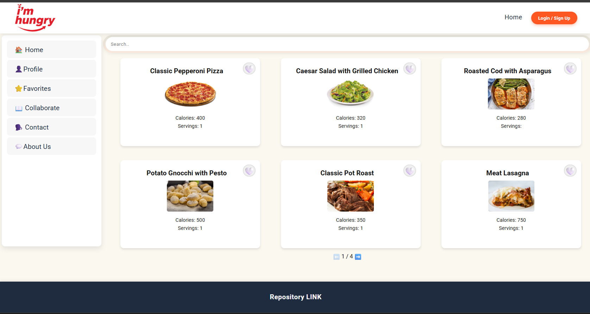
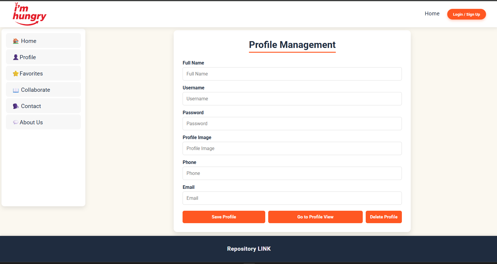
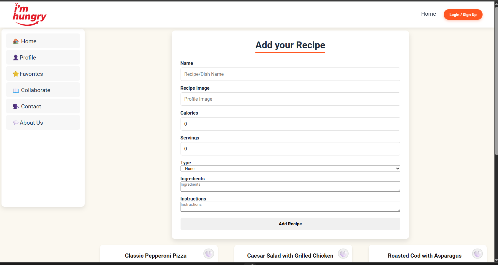

# RECIPE MANAGEMENT APP (I'm Hungry)

# Description

Recipe Management App is a full-stack React + Vite single-page application (SPA) for comprehensive recipe management. Users can browse paginated recipe collections, perform full CRUD operations (Create, Read, Update, Delete), manage favorites, authenticate with persistent profiles, and navigate seamlessly across 12+ interconnected pages. 

The architecture features **centralized global state management** in `App.jsx` with **props drilling** to child components, **React Router v6** for client-side routing, **localStorage persistence** for user data, and a **25+ recipe mock dataset** with consistent data structure. Responsive design ensures optimal experience across desktop, tablet, and mobile devices.

# Main Functionalities

- **Master Layout**: Fixed **Navbar** (top), **Sidebar** (left filters), dynamic **Content** area, **Footer**
- **HomePage**: Paginated 3x2 recipe grid (6/page) with **SearchBar**, **RecipeList**, individual **RecipeCard** components
- **RecipeCard**: Displays image, name, calories, servings + **FavoriteButton** toggle + CRUD actions (edit/delete)
- **Authentication Flow**: **LoginPage** modal → **CreateProfilePage** → **ProfilePage** with localStorage sync
- **Recipe Management**: **AddRecipe** form (create/edit), **RecipesDetailsPage** (full view), delete confirmation
- **Favorites System**: **FavoritesPage** filters global `favorites` array, maintains pagination
- **Global State Flow**: `App.jsx` → Pages → Components via props (recipes, favorites, profile, callbacks)
- **Routing**: 12+ routes including protected pages, 404 handling (**NotFoundPage**)
- **Persistence**: Automatic localStorage sync for profile/login state via `useEffect`

# Recipe Categories

| Category       | Recipe Count | Examples                          |
|----------------|--------------|-----------------------------------|
| Pasta & Pizza  | 4            | Pepperoni Pizza, Meat Lasagna     |
| Meat           | 4            | Pot Roast, Beef Hamburger         |
| Fish           | 3            | Roasted Cod, Grilled Salmon       |
| Asian          | 3            | Chicken Pad Thai, Spicy Curry     |
| Mexican        | 1            | Chicken Fajitas                   |
| Salad          | 1            | Caesar Salad                      |
| Dessert        | 1            | Chocolate Cake                    |
| Soup           | 1            | Red Lentil Soup                   |
| Vegetarian     | 1            | Hearty Chili                      |

# Minimum Viable Product (MVP)

Core features required for production-ready MVP:

- **App Layout**: Navbar + Sidebar + Content + Footer with responsive CSS Grid
- **Recipe Browsing**: HomePage → RecipeList (pagination 6/page) → RecipeCard
- **Authentication**: Login modal + CreateProfile + Profile display
- **CRUD Operations**: AddRecipe form + edit/delete in RecipeCard
- **Favorites**: Toggle system + dedicated FavoritesPage
- **Routing**: React Router with all 12 pages + 404 fallback
- **State Management**: Global state in App.jsx with props drilling
- **Persistence**: localStorage for profile/login across sessions

# Backlog

Post-MVP enhancements:

- **Backend API**: Node.js/Express + MongoDB for recipes/users
- **Advanced Search**: Filter by calories, ingredients, dietary restrictions
- **Image Upload**: Cloudinary/AWS S3 integration
- **Infinite Scroll**: Replace pagination with virtual scrolling
- **Social Features**: Recipe ratings, comments, sharing
- **PWA**: Service Worker + offline support
- **Analytics**: Track most popular recipes, user engagement

# Technologies Used

- **React** + **Vite** (fast dev server, optimized builds)
- **React Router DOM** (file-based routing, nested routes)
- **JavaScript ES6+** (Hooks, async/await, destructuring)
- **localStorage API** + **useEffect** (data persistence)
- **UUID v4** (unique recipe IDs)
- **CSS Grid/Flexbox** (responsive layouts)
- **React Hook Form** principles (controlled components)

# Architecture & File Connections

## Entry Point Flow

main.jsx → BrowserRouter → App.jsx → Routes → Individual Pages

## Complete Props Flow

App.jsx (Global State)
├── Navbar.jsx (receives: openLoginModal)
├── Footer.jsx (static)
├── HomePage.jsx (receives: recipes, favorites, toggleFavorite)
│ ├── SearchBar.jsx (local filtering)
│ └── RecipeList.jsx (receives: recipes, favorites, toggleFavorite)
│ └── RecipeCard.jsx (receives: recipe, isFavorite, toggleFavorite, edit/delete)
│ └── FavoriteButton.jsx (receives: isFavorite, onToggle)
├── ProfilePage.jsx (receives: profile, isLoggedIn, callbacks)
├── FavoritesPage.jsx (receives: favorites, recipes, toggleFavorite)
├── AddRecipe.jsx (receives: onAddRecipe, onUpdateRecipe, initialRecipe)
├── RecipesDetailsPage.jsx (receives: recipes, match.params.id)
└── LoginPage.jsx (modal - receives: onLogin, onClose)

# Data structure

## App.jsx - Global State Hub

### State Properties

- `recipes` — `Array[RecipeObject]` (25+ items from recipesData.js)
- `favorites` — `Array[RecipeObject]` (user-selected recipes)
- `profile` — `{username, email, password, image}` (localStorage synced)
- `isLoggedIn` — `boolean` (authentication flag)
- `isModalOpen` — `boolean` (LoginPage visibility)

### Core Methods (Passed as Props)

#### `toggleFavorite(recipe)`
setFavorites(prev => prev.some(r => r.id === recipe.id)
? prev.filter(r => r.id !== recipe.id)
: [...prev, recipe]);

#### `handleAddRecipe(newRecipe)`
setRecipes(remainingRecipes => [newRecipe, ...remainingRecipes]); // Adds to top

#### `handleDeleteRecipe(recipe_id)`
setRecipes(remainingRecipes => prev.filter(recipe => recipe.id !== recipe_id));

#### `handleLogin(username, password)`
// Validates against stored profile
return profile && (username === profile.username || username === profile.email);

## recipesData.js - Data Layer

### Recipe Schema
{
id: "uuid-v4-string",
name: "Recipe Name",
calories: 400, // Number
image: "https://url", // External CDN
servings: 1, // Number
type: "Pasta & Pizza", // Category filter
ingredients: ["item1", "item2"], // Array[string]
instructions: "Step by step..." // Multi-line string
}

## RecipeList.jsx - Pagination Engine

### State & Logic
const [currentPage, setCurrentPage] = useState(1);
const ITEMS_PER_PAGE = 6;
const startIndex = (currentPage - 1) * ITEMS_PER_PAGE;
const recipesToShow = recipes.slice(startIndex, startIndex + ITEMS_PER_PAGE);

## AddRecipe.jsx - Form Factory

### Dual Mode Operation
- **Create Mode**: `initialRecipe = null` → generates `uuidv4()`
- **Edit Mode**: `initialRecipe` prop → pre-populates form
- Single `handleFormSubmit` handles both via conditional logic

# Component Breakdown

## HomePage.jsx - Main Orchestrator

**Purpose**: Composes the primary recipe discovery experience

**Children Chain**:
HomePage
├── SearchBar (local state filtering)
└── RecipeList
└── RecipeCard ×6 (paginated)
├── FavoriteButton
├── Link to Details
└── Edit/Delete (if authorized)

## Navbar.jsx - Global Navigation

**Responsibilities**:
- Logo → Home (`/`)
- NavLinks → `/profile`, `/favorites`, `/add-recipe`
- Login button → triggers `openLoginModal()` from App

## ProfilePage.jsx - User Dashboard

**Data Flow**:
localStorage.getItem("profileData") → App.jsx useState → ProfilePage props

# Media

## Screenshots

- **Home Dashboard**:
  

- **Mobile Responsive**:
  

- **Profile Management**:
  

- **Recipe Details**:
  

- **Favorites Page**:
  

  - **Collaborate Page**:
  

# States and State Transitions

## Application States

1. **Unauthenticated Home** (`/`)
   - Full recipe grid + login prompt in Navbar
   - Browse → Details → Back

2. **Login Flow**
Navbar Login → LoginPage Modal →
(No Profile) CreateProfilePage →
(Has Profile) ProfilePage

3. **Authenticated State**
ProfilePage ↔ Home ↔ Favorites ↔ AddRecipe

4. **Recipe Deep Dive**
Any RecipeCard → RecipesDetailsPage(/recipe/:id)

5. **Protected Routes**
/profile, /favorites, /add-recipe
(redirects unauthenticated users)

# Task - Development Roadmap

## Phase 1: Foundation (Complete)
1. **Vite + Router Setup**
- `npm create vite@latest --template react`
- `npm i react-router-dom uuid`

2. **Core Architecture**
- App.jsx (Routes + Global State)
- Master layout (Navbar/Sidebar/Footer)

3. **Data Layer**
- recipesData.js (25+ recipes)
- Global state with persistence

## Phase 2: Core Features (Complete)
4. **Recipe Browsing**
- HomePage → RecipeList → RecipeCard chain
- Pagination (6/page) + SearchBar

5. **Authentication**
- Login modal + CreateProfile + ProfilePage
- localStorage persistence

6. **CRUD Operations**
- AddRecipe (create/edit modes)
- Delete/Update in RecipeCard

## Phase 3: Polish (Complete)
7. **Additional Pages**
- FavoritesPage, About, Contact, Collaborate
- RecipesDetailsPage, NotFoundPage

8. **Responsive Design**
- CSS Grid breakpoints
- Mobile-first touch targets

# Recent Updates

## Production Features

- **Full CRUD Pipeline**
- ✅ Add/Edit/Delete with single reusable form
- ✅ Visual confirmation + error states
- ✅ UUID collision protection

- **Advanced State Management**
- ✅ Global favorites sync across pages
- ✅ Profile persistence (multi-tab support)
- ✅ Real-time UI updates via props

- **Enterprise Routing**
- ✅ 12+ protected routes
- ✅ Dynamic `/recipe/:id` matching
- ✅ 404 fallback + breadcrumbs

- **Performance Optimizations**
- ✅ Pagination prevents DOM overload
- ✅ Memoized recipe filtering
- ✅ Lazy-loaded detail pages

# Deployment & Links

- [GitHub Repository](https://github.com/pablovqueiroz/recipe-app)
- [Vite Documentation](https://vitejs.dev/guide/)
- [React Router Docs](https://reactrouter.com/en/main)